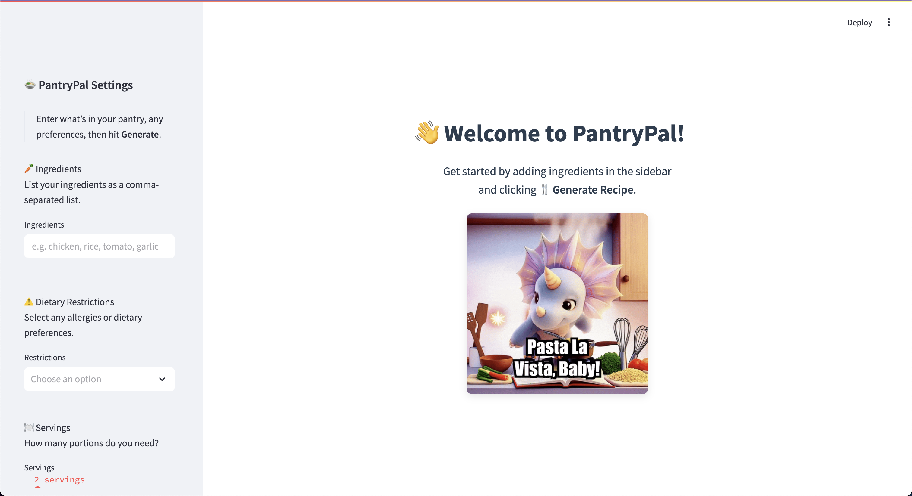
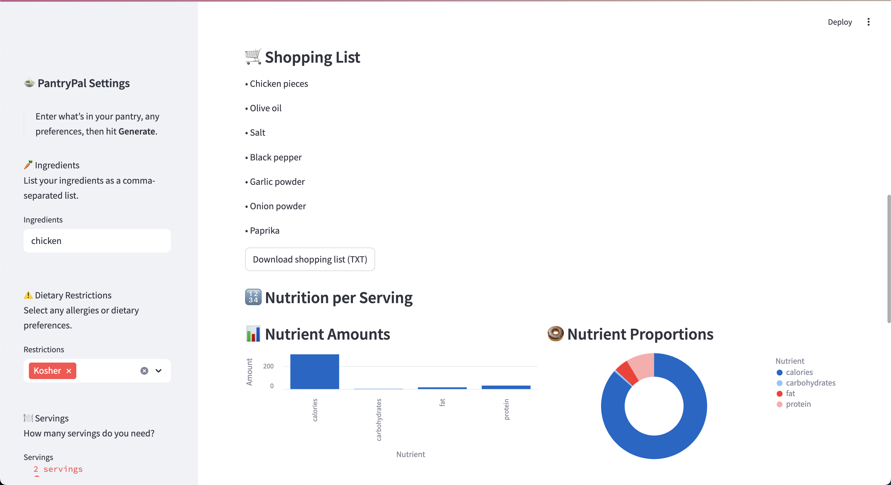

# PantryPal – AI Recipe Generator 🥕

**Meet PantryPal: Your Personal AI-Powered Sous-Chef** 🎉🍽️

Say goodbye to pantry panic! PantryPal instantly transforms whatever you’ve got on hand—plus any dietary preferences—into mouth-watering, chef-level recipes in just seconds. No more copy-pasting lists into ChatGPT or scrolling through endless recipe sites.  

Built from the frustration of “what’s for dinner?”, PantryPal combines the power of Google Gemini AI with a sleek, intuitive Streamlit interface. Simply list your ingredients, set your dietary restrictions and servings, and watch as AI crafts a custom recipe complete with step-by-step instructions, nutrition breakdown, shopping list, and stunning hero images. Cooking has never been this effortless—or this inspiring!

<p align="center">
  
  
  
  
  
  
  
  
  
  
  
</p>

## Table of Contents

- [🌐 Live App](#-live-app)
- [📝 Features](#-features)
- [🛠️ Prerequisites](#-prerequisites)
- [🚀 Installation](#-installation)
- [🔑 Configuration](#-configuration)
- [📂 Directory Structure](#-directory-structure)
- [▶️ Running the App](#-running-the-app)
- [🧰 Linting & Formatting](#-linting--formatting)
- [🧑‍🍳 How to Use](#-how-to-use)
- [⚙️ Customization](#-customization)
- [🐳 Docker Support](#-docker-support)
- [📊 Analysis Scripts](#-analysis-scripts)
- [🤝 Contributing](#-contributing)
- [📄 License](#-license)
- [📧 Contact](#-contact)
- [🙏 Acknowledgments](#-acknowledgments)

## 🌐 Live App

Try it now in your browser: **[https://pantrypal-app.streamlit.app](https://pantrypal-app.streamlit.app)**. Feel free to explore and generate recipes with your pantry items!

### Home Page

<p align="center">
   
</p>

### Recipe Page

<p align="center">
   
</p>

<p align="center">
   
</p>

## 📝 Features

Although **Streamlit** is not a full-fledged web framework, it provides a simple and effective way to create 
interactive data-based web applications. Here are some of the key features of PantryPal:

- **Pantry-based recipe generation**: Enter your pantry items and get a recipe tailored to what you have.
- **Surprise Me!**: Let the AI create a random recipe from scratch.
- **Dietary restrictions**: Choose from options like Vegetarian, Vegan, Gluten-Free, and more.
- **Servings slider**: Adjust the number of servings from 1 to 12.
- **Hero image selection**: Pick a beautiful image for your recipe from Unsplash.
- **Interactive ingredients checklist**: Check off ingredients as you gather them.
- **Shopping list download**: Download a TXT file of your shopping list.
- **Nutrition bar & donut charts**: Visualize the nutritional breakdown per serving.
- **Estimated difficulty**: Get an idea of how challenging the recipe is.
- **Download recipe**: Save your recipe as JSON, Markdown, or plain TXT.
- **Docker support**: Run the app in a containerized environment for easy deployment.
- **Linting & formatting**: Code is formatted with Black and imports are sorted with isort.
- **Environment variable management**: Use `.env` or `.streamlit/secrets.toml` for sensitive information.
- **Interactive charts**: Nutrition information is displayed using Altair for better visualization.
- **Persistent storage**: Recipe history is saved and persists across sessions for easy access.
- **User-friendly UI**: Built with Streamlit for a clean and intuitive interface.

## 🛠️ Prerequisites

- Python 3.9 or later  
- A Google Cloud API key with access to the Generative AI (Gemini) API  
- An Unsplash developer access key for fetching food images  

## 🚀 Installation

1. **Clone the repository**  
   ```bash
   git clone https://github.com/hoangsonww/PantryPal-Streamlit-App.git
   cd PantryPal-Streamlit-App
   ```

2. **Create & activate a virtual environment**  
   ```bash
   python3 -m venv .venv
   source .venv/bin/activate      # for macOS/Linux
   .venv\Scripts\activate         # for Windows PowerShell
   ```

3. **Install dependencies**  
   ```bash
   pip install --upgrade pip
   pip install -r requirements.txt
   ```

## 🔑 Configuration

Create a file named `.env` in the project root with the following variables:

```ini
# .env
GOOGLE_AI_API_KEY=<YOUR_GOOGLE_GEMINI_API_KEY>
UNSPLASH_ACCESS_KEY=<YOUR_UNSPLASH_ACCESS_KEY>
```

- **GOOGLE_AI_API_KEY**: Your Google Cloud API key for the Generative AI (Gemini) API.  
- **UNSPLASH_ACCESS_KEY**: Your Unsplash Access Key (register at https://unsplash.com/developers).

Alternatively, create a `.streamlit/secrets.toml` file with the same variables:

```toml
# .streamlit/secrets.toml
GOOGLE_AI_API_KEY = "<YOUR_GOOGLE_GEMINI_API_KEY>"
UNSPLASH_ACCESS_KEY = "<YOUR_UNSPLASH_ACCESS_KEY>"
```

## 📂 Directory Structure

```
pantrypal/
├── app.py
├── .env                 # Environment variables
├── .streamlit/
│   ├── config.toml      # Streamlit configuration
│   └── secrets.toml     # Alternative for .env
├── Dockerfile           # Dockerfile for containerization
├── docker-compose.yml   # Docker Compose file
├── analysis/
│   ├── ingredient_frequency.py
│   ├── nutrition_summary.py
│   └── trends_over_time.py
├── components/
│   ├── inputs.py        # Sidebar input UI
│   └── display.py       # Recipe & history rendering
├── utils/
│   ├── genai_client.py  # Gemini AI wrapper
│   ├── image_fetcher.py # Unsplash image fetcher
│   └── storage.py       # JSON‐file storage for history
├── requirements.txt     # Python dependencies
└── README.md            # This file
```

## ▶️ Running the App

With your virtual environment active and `.env` configured, simply run:

```bash
streamlit run app.py
```

Then open the URL shown in your terminal (e.g. `http://localhost:8501`) in your browser.

## 🧰 Linting & Formatting

We use **Black** for code formatting and **isort** for import sorting. To check and format your code, run:

```bash
# Check code style
black --check .
isort --check .

# Format code
black .
isort .
```

## 🧑‍🍳 How to Use

1. **Enter Ingredients**  
   - Paste a comma-separated list of pantry items (e.g. `chicken, rice, tomato`).  
2. **Select Dietary Restrictions** (optional)  
   - Choose from Vegetarian, Vegan, Gluten-Free, Dairy-Free, etc.  
3. **Adjust Servings**  
   - Slide to set portions (1–12).  
4. **Generate**  
   - Click **Generate Recipe** to fetch from Gemini AI.  
5. **Pick a Hero Image**  
   - If images are available, select your favorite and click **Confirm Image** once.  
6. **View Recipe**  
   - See the title, image, ingredients checklist, shopping list, nutrition charts, difficulty, instructions, and substitutions.  
7. **Download**  
   - Grab the recipe as JSON, Markdown, or plain TXT; download your shopping list (TXT).  
8. **History**  
   - Scroll down to revisit past recipes; use **Delete** to remove any entry.  
9. **Surprise Me!**  
   - Click to have Gemini invent a random recipe from scratch (no pantry required).  
10. **Clear History**  
    - Wipe all saved recipes with one click.  
11. **Enjoy Cooking!**  
    - Get cooking with your generated recipe! 🧑‍🍳

## ⚙️ Customization

- **Max output tokens** & **temperature** for AI calls can be adjusted in `utils/genai_client.py`.  
- **Caching** for images is handled in `utils/image_fetcher.py` (TTL = 1 hour).  
- **Recipe History** uses Local Storage to persist recipe history across sessions.
  - This allows you to revisit past recipes without needing to regenerate them.

## 🐳 Docker Support

To run the app in a Docker container, use the provided `Dockerfile` and `docker-compose.yml`. Build and run the container with:

```bash
docker-compose up --build
```

This will create a Docker image and start the app in a container. Access it at `http://localhost:8501`.

## 📊 Analysis Scripts

Once you have generated some recipes, you can analyze the data using the scripts in the `analysis/` directory. These scripts provide insights into ingredient frequency, nutrition summaries, and trends over time.

Run the following commands from the project root to execute the analysis scripts:

```bash
python analysis/ingredient_frequency.py
python analysis/nutrition_summary.py
python analysis/trends_over_time.py
```

## 🤝 Contributing

1. Fork the repo  
2. Create a new branch (`git checkout -b feature/foo`)  
3. Commit your changes (`git commit -m "Add foo"`)  
4. Push to the branch (`git push origin feature/foo`)  
5. Open a Pull Request  

## 📄 License

This project is licensed under the MIT License. See [LICENSE](./LICENSE) for details.

## 📧 Contact

This project is created and maintained by [Son Nguyen](https://sonnguyenhoang.com). Below are my contact details:
- LinkedIn: [hoangsonw](https://www.linkedin.com/in/hoangsonw/)
- GitHub: [@hoangsonww](https://github.com/hoangsonww)

## 🙏 Acknowledgments

- [Streamlit](https://streamlit.io/) for the web framework  
- [Google Gemini AI](https://cloud.google.com/generative-ai) for recipe generation  
- [Unsplash](https://unsplash.com/) for beautiful images  
- [Altair](https://altair-viz.github.io/) for interactive charts  
- [Python-dotenv](https://pypi.org/project/python-dotenv/) for environment variable management  
- [pandas](https://pandas.pydata.org/) for data manipulation  
- [Snowflake](https://www.snowflake.com/) for cloud deployment

---

Thank you for checking out PantryPal! 
We hope it makes your cooking adventures easier and more fun. If you have any questions or suggestions, feel free to reach out! 🚀

[⬆️ Back to Top](#pantrypal--ai-recipe-generator-)
